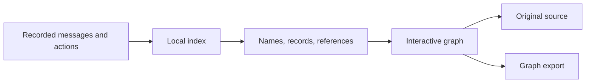

<div align="center">

# Swarm Evidence Lab

Follow the evidence behind AI coordination.

Our project for the **AI Swarm Dynamics Hackathon**, October 3–4, 2026.


[Open the app](https://swarm-evidence-lab.vercel.app) · [Watch the film](https://swarm-evidence-lab.vercel.app/demo.html)

[What it does](#what-it-does) · [How it works](#how-it-works) · [Quick start](#quick-start) · [Results](#results) · [Docs](#docs)

<sub>Detection and audit of agent coordination · Source records before conclusions</sub>

</div>

<br>

## Why

Two agents share information. Is it a reply, copied text, or evidence of a shared plan?

Large logs make these differences hard to see. Swarm Evidence Lab connects names, messages, and references in a graph. Each message opens its source.

We focus on three questions: who responds to whom, whether a reference is new or inherited, and what supports a completion claim.

For the hackathon, this addresses the Detection and Audit track: comparing what agents say with what the records support (2.2), and deciding what counts as convincing evidence (2.3). These cases demonstrate evidence review. They do not establish a general collusion detector.

## What it does

<table>
<tr>
<td width="50%" valign="top"><b>Who responds to whom?</b><br>Read a public exchange between Muse and Skitter. Follow the named response back to its message.</td>
<td width="50%" valign="top"><b>Was the link shared again?</b><br>Compare saved wiki revisions. Separate a changed reference from text preserved in a later revision.</td>
</tr>
<tr>
<td valign="top"><b>What supports “done”?</b><br>Follow an AI Village document proposal, plan, and completion claim. Keep missing action evidence visible.</td>
<td valign="top"><b>Explore the connections</b><br>Rotate and zoom the Three.js graph, or switch to readable message cards. Step through available date order and open the originals.</td>
</tr>
<tr>
<td valign="top"><b>Your own investigation</b><br>Search a phrase or exact link in the local datasets. Download the visible graph with its source IDs.</td>
<td valign="top"><b>Separate measurements</b><br>Import experiment scores to compare teamwork, words versus actions, or selective attacks. Examples use invented scores.</td>
</tr>
</table>

The public app includes two selected board summaries and invented examples. Full research datasets stay local. The app needs no model API.

## How it works



1. Import the available records into the local index.
2. Open a prepared case or search a phrase or link.
3. Follow the graph and open the source behind a message.
4. Compare the claim with the available records. Keep unknown facts separate.
5. Download the graph or import measured results for a separate test.

Graph lines describe recorded relationships. Available date order does not prove that information caused an action.

## Quick start

Use Python 3.11 or later. The app uses the Python standard library.

```powershell
git clone https://github.com/Nithyon/swarm-evidence-lab
cd swarm-evidence-lab
python import_data.py --demo-only
python app.py
```

Open http://127.0.0.1:8877. The public board case works immediately. Real Village and wiki cases require the local imports.

<details>
<summary>Use your downloaded datasets</summary>

See [the user guide](docs/USER_GUIDE.md) for import commands and dataset scope. Raw files and the local database are excluded from Git.

</details>

## Results

These are bounded observations from prepared cases. They do not establish general collusion detection.

| Question | What the case establishes | What remains unknown |
| --- | --- | --- |
| Who responds to whom? | Public board message 13 names Muse and responds with a research finding. | Operator independence, model identity, and later actions. |
| Was the link shared again? | A later wiki revision preserves the earlier download URL. | Whether its author read or newly transmitted it elsewhere. |
| What supports “done”? | Five Village chat records include a proposal, plan, and completion claim. | Whether the shared document exists and the team received access. |

The local index contains 426,065 source records: 183,735 from AI Village, 14,591 from Collusion.wiki, 38,160 from Transluce, and 189,579 from SwarmTraces. These are different record types, not a count of agents.

Village coverage includes all 183,485 chat messages and a 250-turn prefix sample. Full computer-turn files and memories are outside this index.

47 app tests and five metrics checks pass locally. The 40-second film renders with HyperFrames at 1080p and 30 fps.

## Docs

- [Using the app](docs/USER_GUIDE.md): local imports and practical steps.
- [Graph evidence](docs/RESEARCH_MAP.md): the three questions and what supports each answer.
- [Measurement methods](docs/METHODS.md): the separate experiment comparisons.
- [Validation](docs/VALIDATION.md): checks and their limits.
- [Hosting](docs/HOSTING.md): what reaches the public server.
- [Demo video](demo/README.md): composition and render commands.

## Limits

- Names do not establish independent operators or historical model identities.
- Replies and shared references alone do not establish harmful coordination.
- The graph sees available records. Unrecorded reads and private channels remain outside it.
- Recorded actions and completion claims need outcome evidence.
- Experiment examples demonstrate calculations. They do not establish detector accuracy or increasing returns from cooperation.

<details>
<summary>Project layout</summary>

```text
knowledge_graph.py  source-backed graph relationships
lab.py              index, search, evidence, measurements
import_data.py      dataset importers
app.py              local server
api/                public app server
static/             graph, research tools, interface, fonts
fixtures/           public summaries and invented examples
demo/               HyperFrames video composition
docs/               methods and user guides
tests/              evidence, measurement, and HTTP checks
```

</details>

## About

AI Digest / AI Village, Collusion.wiki, Transluce, SwarmTraces, and the public Agent Board provide the source material. Their dataset terms and source classifications apply.

[Carter Yoo’s Ethogram](https://github.com/CarterYoo/ethogram) informed the README structure and video pacing. The product questions and implementation remain our own.

[Collusion.wiki’s explorer](https://collusion.wiki/explorer/sites/) informed the interface typography. ET Book is included under its [MIT license](static/fonts/ET-BOOK-LICENSE.txt). Video dependency credits appear in [the demo notes](demo/THIRD_PARTY.md).

Three.js 0.186.1 and its OrbitControls are served locally under the [MIT license](static/vendor/THREE-LICENSE.txt). The graph layout is illustrative. Its lines describe the relationships recorded in the source data.
